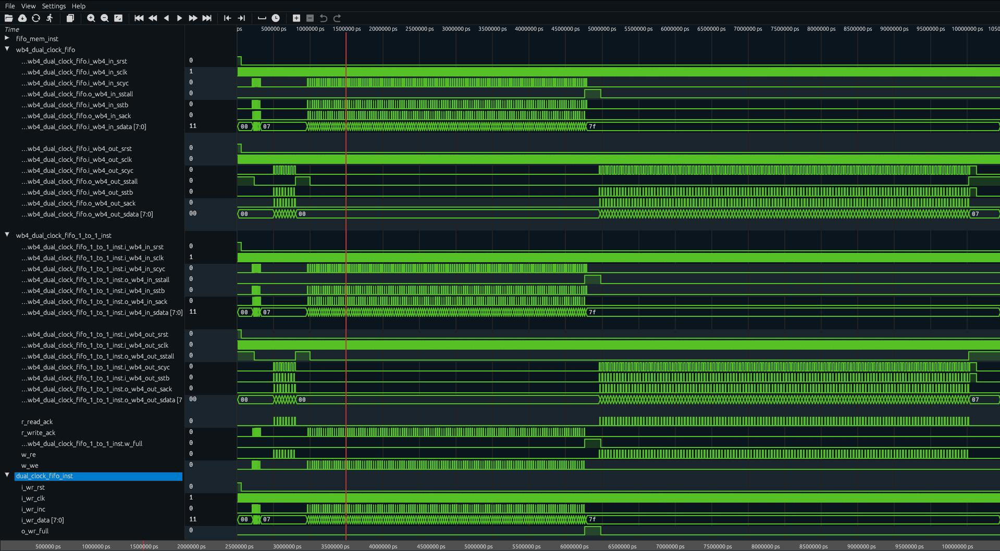
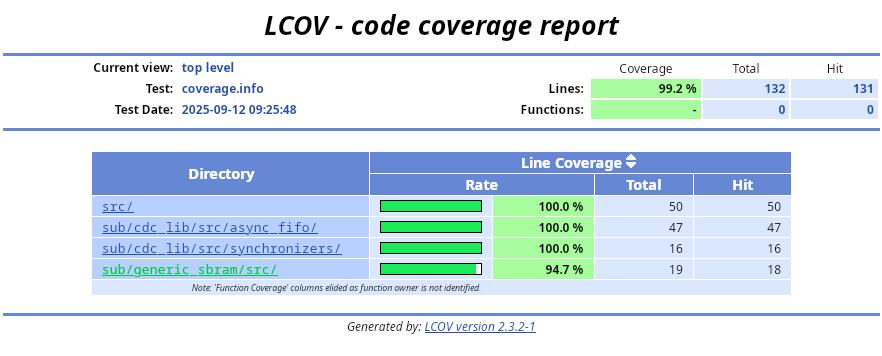
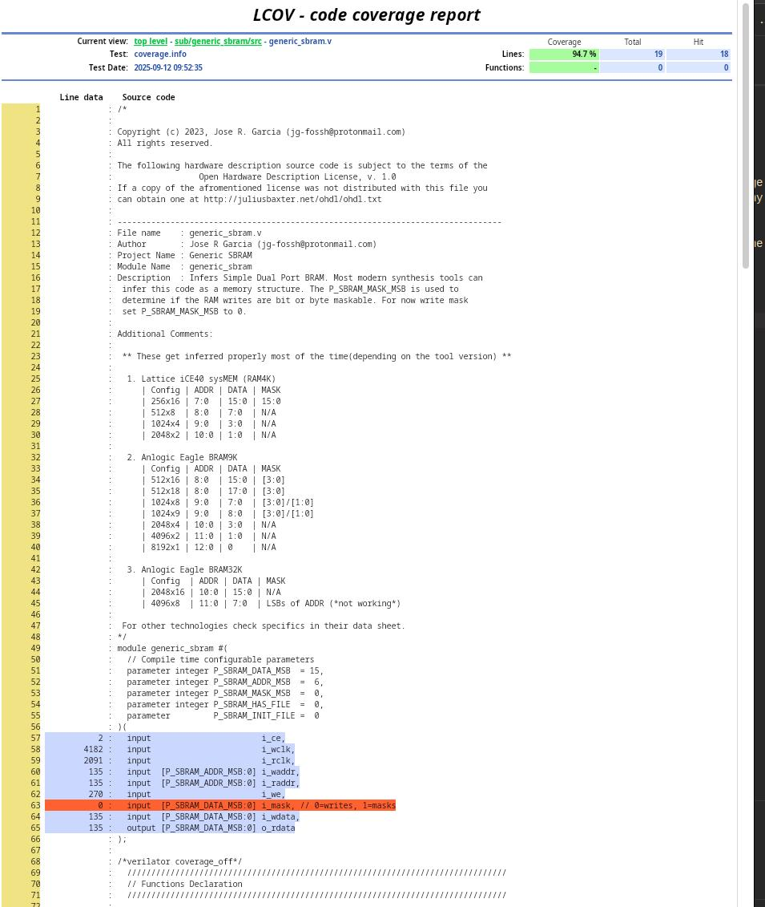

# Wishbone B4 FIFO Library

The main focus of this project is provide and integrated example of `verilator`+`uvm-systemc`. It intents to 
 - Be close to what many engineers have seen when using SystemVerilog UVM. 
 - Simple(or minimal complexity), so it can be malleable and adaptable to other projects.
 - Feature complete(Self-Checking, monitoring, coverage, randomization).

## Getting Started

Clone the repo and be sure to pull in the submodules
```
git clone --recurse-submodules git@github.com:jg-fossh/wb4_fifo_lib.git
```

## Dependencies 

- lcov
- systemc
- uvm-systemc
- verilator
- surfer or gtkwave
- surf or any web browser
- yosys (if you want to synthesize the design)
- nextpnr (if you want to map and place & route the design)


*This project was written in a linux enviroment. While the tools may be available on other systems, the makefiles have not been testes under any other OS.*

## Simulation

### Running the simulation

At the top directory run command `make sim`. The test will compile and run. This is a self-checking, in the log you will find the test score(PASSED/FAILED) and the match/mismatch transactions count.

```
Running Simulation

make -C ./sim/verilator/wb4_dual_clock_fifo all
make[1]: Entering directory '/home/jota/HDL_Sandbox/git_jg-fossh/wb4_fifo_lib/sim/verilator/wb4_dual_clock_fifo'

Cleaning TB...

rm -rf obj_dir logs *.log *.dmp *.vpd core

Verilating...

verilator -DVL_THREADED -LDFLAGS "-lstdc++ -lm -lsystemc -luvm-systemc" -j 4 --x-assign 0 --assert --assert-case --coverage --coverage-underscore --trace-coverage --default-language 1800-2012 --trace-fst --trace-structs --trace-max-array 2048 --trace-threads 2  --threads 4 --build-jobs 4 --timescale-override 1ps/1ps --timing --sc --exe --top-module wb4_dual_clock_fifo ../../../tb/wb4_dual_clock_fifo/uvmsc/sc_main.cc ../../../sub/generic_sbram/src/generic_sbram.v ../../../sub/cdc_lib/src/synchronizers/synchronizer.v ../../../sub/cdc_lib/src/async_fifo/rd_ctrl.v ../../../sub/cdc_lib/src/async_fifo/wr_ctrl.v ../../../sub/cdc_lib/src/async_fifo/wr_ctrl_n2one.v ../../../sub/cdc_lib/src/async_fifo/dual_clock_fifo.v ../../../sub/cdc_lib/src/async_fifo/dual_clock_fifo_n2one.v ../../../src/wb4_dual_clock_fifo_1_to_1.v ../../../src/wb4_dual_clock_fifo_N_to_1.v ../../../src/wb4_dual_clock_fifo.v
- V e r i l a t i o n   R e p o r t: Verilator 5.036 2025-04-27 rev v5.036
- Verilator: Built from 0.344 MB sources in 11 modules, into 0.537 MB in 30 C++ files needing 0.000 MB
- Verilator: Walltime 0.046 s (elab=0.002, cvt=0.033, bld=0.000); cpu 0.056 s on 4 threads; alloced 20.633 MB

Compiling Test Bench...

make -j4 -C obj_dir -f Vwb4_dual_clock_fifo.mk Vwb4_dual_clock_fifo
make[2]: Entering directory '/home/jota/HDL_Sandbox/git_jg-fossh/wb4_fifo_lib/sim/verilator/wb4_dual_clock_fifo/obj_dir'
g++  -I.  -MMD -I/usr/share/verilator/include -I/usr/share/verilator/include/vltstd -DVM_COVERAGE=1 -DVM_SC=1 -DVM_TIMING=0 -DVM_TRACE=1 -DVM_TRACE_FST=1 -DVM_TRACE_VCD=0 -DVM_TRACE_SAIF=0 -faligned-new -fcf-protection=none -Wno-bool-operation -Wno-shadow -Wno-sign-compare -Wno-subobject-linkage -Wno-tautological-compare -Wno-uninitialized -Wno-unused-but-set-parameter -Wno-unused-but-set-variable -Wno-unused-parameter -Wno-unused-variable      -I/usr/include  -Os  -c -o sc_main.o ../../../../tb/wb4_dual_clock_fifo/uvmsc/sc_main.cc
g++ -Os  -I.  -MMD -I/usr/share/verilator/include -I/usr/share/verilator/include/vltstd -DVM_COVERAGE=1 -DVM_SC=1 -DVM_TIMING=0 -DVM_TRACE=1 -DVM_TRACE_FST=1 -DVM_TRACE_VCD=0 -DVM_TRACE_SAIF=0 -faligned-new -fcf-protection=none -Wno-bool-operation -Wno-shadow -Wno-sign-compare -Wno-subobject-linkage -Wno-tautological-compare -Wno-uninitialized -Wno-unused-but-set-parameter -Wno-unused-but-set-variable -Wno-unused-parameter -Wno-unused-variable      -I/usr/include  -c -o verilated.o /usr/share/verilator/include/verilated.cpp
g++ -Os  -I.  -MMD -I/usr/share/verilator/include -I/usr/share/verilator/include/vltstd -DVM_COVERAGE=1 -DVM_SC=1 -DVM_TIMING=0 -DVM_TRACE=1 -DVM_TRACE_FST=1 -DVM_TRACE_VCD=0 -DVM_TRACE_SAIF=0 -faligned-new -fcf-protection=none -Wno-bool-operation -Wno-shadow -Wno-sign-compare -Wno-subobject-linkage -Wno-tautological-compare -Wno-uninitialized -Wno-unused-but-set-parameter -Wno-unused-but-set-variable -Wno-unused-parameter -Wno-unused-variable      -I/usr/include  -c -o verilated_dpi.o /usr/share/verilator/include/verilated_dpi.cpp
g++ -Os  -I.  -MMD -I/usr/share/verilator/include -I/usr/share/verilator/include/vltstd -DVM_COVERAGE=1 -DVM_SC=1 -DVM_TIMING=0 -DVM_TRACE=1 -DVM_TRACE_FST=1 -DVM_TRACE_VCD=0 -DVM_TRACE_SAIF=0 -faligned-new -fcf-protection=none -Wno-bool-operation -Wno-shadow -Wno-sign-compare -Wno-subobject-linkage -Wno-tautological-compare -Wno-uninitialized -Wno-unused-but-set-parameter -Wno-unused-but-set-variable -Wno-unused-parameter -Wno-unused-variable      -I/usr/include  -c -o verilated_cov.o /usr/share/verilator/include/verilated_cov.cpp
g++ -Os  -I.  -MMD -I/usr/share/verilator/include -I/usr/share/verilator/include/vltstd -DVM_COVERAGE=1 -DVM_SC=1 -DVM_TIMING=0 -DVM_TRACE=1 -DVM_TRACE_FST=1 -DVM_TRACE_VCD=0 -DVM_TRACE_SAIF=0 -faligned-new -fcf-protection=none -Wno-bool-operation -Wno-shadow -Wno-sign-compare -Wno-subobject-linkage -Wno-tautological-compare -Wno-uninitialized -Wno-unused-but-set-parameter -Wno-unused-but-set-variable -Wno-unused-parameter -Wno-unused-variable      -I/usr/include  -c -o verilated_fst_c.o /usr/share/verilator/include/verilated_fst_c.cpp
g++ -Os  -I.  -MMD -I/usr/share/verilator/include -I/usr/share/verilator/include/vltstd -DVM_COVERAGE=1 -DVM_SC=1 -DVM_TIMING=0 -DVM_TRACE=1 -DVM_TRACE_FST=1 -DVM_TRACE_VCD=0 -DVM_TRACE_SAIF=0 -faligned-new -fcf-protection=none -Wno-bool-operation -Wno-shadow -Wno-sign-compare -Wno-subobject-linkage -Wno-tautological-compare -Wno-uninitialized -Wno-unused-but-set-parameter -Wno-unused-but-set-variable -Wno-unused-parameter -Wno-unused-variable      -I/usr/include  -c -o verilated_threads.o /usr/share/verilator/include/verilated_threads.cpp
python3 /usr/share/verilator/bin/verilator_includer -DVL_INCLUDE_OPT=include Vwb4_dual_clock_fifo.cpp Vwb4_dual_clock_fifo___024root__DepSet_hb8398655__0.cpp Vwb4_dual_clock_fifo___024root__DepSet_h7f8eff10__0.cpp Vwb4_dual_clock_fifo_wb4_dual_clock_fifo__DepSet_h41f5cd88__0.cpp Vwb4_dual_clock_fifo_wb4_dual_clock_fifo_1_to_1__DepSet_h9a2abe9a__0.cpp Vwb4_dual_clock_fifo_wb4_dual_clock_fifo_1_to_1__DepSet_h5d9e06d7__0.cpp Vwb4_dual_clock_fifo_dual_clock_fifo__DepSet_hc4712dae__0.cpp Vwb4_dual_clock_fifo_dual_clock_fifo__DepSet_h9bd7960b__0.cpp Vwb4_dual_clock_fifo_generic_sbram__P7_PB6__DepSet_h62224734__0.cpp Vwb4_dual_clock_fifo_generic_sbram__P7_PB6__DepSet_h35a6c071__0.cpp Vwb4_dual_clock_fifo__Dpi.cpp Vwb4_dual_clock_fifo__Trace__0.cpp Vwb4_dual_clock_fifo___024root__Slow.cpp Vwb4_dual_clock_fifo___024root__DepSet_hb8398655__0__Slow.cpp Vwb4_dual_clock_fifo___024root__DepSet_h7f8eff10__0__Slow.cpp Vwb4_dual_clock_fifo_wb4_dual_clock_fifo__Slow.cpp Vwb4_dual_clock_fifo_wb4_dual_clock_fifo__DepSet_h41f5cd88__0__Slow.cpp Vwb4_dual_clock_fifo_wb4_dual_clock_fifo__DepSet_h195335e5__0__Slow.cpp Vwb4_dual_clock_fifo_wb4_dual_clock_fifo_1_to_1__Slow.cpp Vwb4_dual_clock_fifo_wb4_dual_clock_fifo_1_to_1__DepSet_h9a2abe9a__0__Slow.cpp Vwb4_dual_clock_fifo_wb4_dual_clock_fifo_1_to_1__DepSet_h5d9e06d7__0__Slow.cpp Vwb4_dual_clock_fifo_dual_clock_fifo__Slow.cpp Vwb4_dual_clock_fifo_dual_clock_fifo__DepSet_hc4712dae__0__Slow.cpp Vwb4_dual_clock_fifo_dual_clock_fifo__DepSet_h9bd7960b__0__Slow.cpp Vwb4_dual_clock_fifo_generic_sbram__P7_PB6__Slow.cpp Vwb4_dual_clock_fifo_generic_sbram__P7_PB6__DepSet_h62224734__0__Slow.cpp Vwb4_dual_clock_fifo_generic_sbram__P7_PB6__DepSet_h35a6c071__0__Slow.cpp Vwb4_dual_clock_fifo__Syms.cpp Vwb4_dual_clock_fifo__Trace__0__Slow.cpp Vwb4_dual_clock_fifo__TraceDecls__0__Slow.cpp > Vwb4_dual_clock_fifo__ALL.cpp
echo "" > Vwb4_dual_clock_fifo__ALL.verilator_deplist.tmp
g++ -Os  -I.  -MMD -I/usr/share/verilator/include -I/usr/share/verilator/include/vltstd -DVM_COVERAGE=1 -DVM_SC=1 -DVM_TIMING=0 -DVM_TRACE=1 -DVM_TRACE_FST=1 -DVM_TRACE_VCD=0 -DVM_TRACE_SAIF=0 -faligned-new -fcf-protection=none -Wno-bool-operation -Wno-shadow -Wno-sign-compare -Wno-subobject-linkage -Wno-tautological-compare -Wno-uninitialized -Wno-unused-but-set-parameter -Wno-unused-but-set-variable -Wno-unused-parameter -Wno-unused-variable      -I/usr/include  -c -o Vwb4_dual_clock_fifo__ALL.o Vwb4_dual_clock_fifo__ALL.cpp
g++      sc_main.o verilated.o verilated_dpi.o verilated_cov.o verilated_fst_c.o verilated_threads.o Vwb4_dual_clock_fifo__ALL.a   -lstdc++ -lm -lsystemc -luvm-systemc -lz  -pthread -lpthread -latomic  -lsystemc -o Vwb4_dual_clock_fifo
rm Vwb4_dual_clock_fifo__ALL.verilator_deplist.tmp
make[2]: Leaving directory '/home/jota/HDL_Sandbox/git_jg-fossh/wb4_fifo_lib/sim/verilator/wb4_dual_clock_fifo/obj_dir'

Running Sim...

obj_dir/Vwb4_dual_clock_fifo

        SystemC 2.3.4-Accellera --- Mar  6 2023 09:32:15
        Copyright (c) 1996-2022 by all Contributors,
        ALL RIGHTS RESERVED
SYSTEMC_VERSION: 20221128


Warning: (W570) attempt to use an empty process handle ignored: dont_initialize()
In file: /usr/src/debug/systemc/systemc-2.3.4/src/sysc/kernel/sc_process_handle.h:284

Warning: (W570) attempt to use an empty process handle ignored: dont_initialize()
In file: /usr/src/debug/systemc/systemc-2.3.4/src/sysc/kernel/sc_process_handle.h:284


   Universal Verification Methodology for SystemC (UVM-SystemC)
              Version: 1.0-beta2  Date: 2018-10-24
          Copyright (c) 2006 - 2018 by all Contributors
            See NOTICE file for all Contributors
                    ALL RIGHTS RESERVED
         Licensed under the Apache License, Version 2.0


UVM_INFO @ 0 s: reporter [RNTST] Running test test_fifo_default...
UVM_INFO ../../../../tb/wb4_dual_clock_fifo/uvmsc/tb_env.h(76) @ 0 s: test_fifo_default.env [env::build_phase] tb_env build phase
UVM_WARNING @ 0 s: test_fifo_default.env.rst_agent [ACTPASS:] Active or passive mode for agent 'test_fifo_default.env.rst_agent' has not been defined. Default behavior is active.
UVM_WARNING @ 0 s: test_fifo_default.env.wb4_csr_agent [ACTPASS:] Active or passive mode for agent 'test_fifo_default.env.wb4_csr_agent' has not been defined. Default behavior is active.
UVM_WARNING @ 0 s: test_fifo_default.env.wb4_mst_agent [ACTPASS:] Active or passive mode for agent 'test_fifo_default.env.wb4_mst_agent' has not been defined. Default behavior is active.
UVM_INFO ../../../../tb/wb4_dual_clock_fifo/uvmsc/tb_env.h(117) @ 0 s: test_fifo_default.env [env::connect_phase] in tb_env connect phase
UVM_INFO ../../../../tb/wb4_dual_clock_fifo/uvmsc/tb_env.h(133) @ 0 s: test_fifo_default.env [env::end_of_elaboration_phase] Enviroment Configuration :
----------------------------------------------------------
Name                   Type                    Size  Value
----------------------------------------------------------
object_0               tb_config               -     @144
  rst_cfg              reset_generator_config  -     @145
    PWR_ON_RST         SC_NS                   32    0x32
    SHORT_PULSE_RST    SC_NS                   32    0x21
    LONG_PULSE_RST     SC_NS                   32    0xc8
    is_negated         string                  5     false
    has_pwr_on_rst     string                  4     true
  wb4_mst_cfg          wb4_config              -     @146
    has_checks         string                  5     false
    has_coverage       string                  5     false
    is_async           string                  5     false
    driving_edge       wb4_clocking_edge_e     32    0x0
    sampling_edge      wb4_clocking_edge_e     32    0x0
    data_unit          wb4_data_unit_e         32    0x8
    data_granularity   wb4_granularity_e       32    0x1
    data_operand_size  wb4_operand_size_e      32    0x8
  wb4_csr_cfg          wb4_config              -     @147
    has_checks         string                  5     false
    has_coverage       string                  5     false
    is_async           string                  5     false
    driving_edge       wb4_clocking_edge_e     32    0x0
    sampling_edge      wb4_clocking_edge_e     32    0x1
    data_unit          wb4_data_unit_e         32    0x8
    data_granularity   wb4_granularity_e       32    0x1
    data_operand_size  wb4_operand_size_e      32    0x8
----------------------------------------------------------

UVM_INFO ../../../../tb/wb4_dual_clock_fifo/uvmsc/test_base.h(81) @ 0 s: test_fifo_default [test_fifo_default::end_of_elaboration_phase] Test Topology :
-----------------------------------------------------------------
Name                       Type                       Size  Value
-----------------------------------------------------------------
test_fifo_default          test_fifo_default          -     @090
  env                      tb_env                     -     @142
    in_sb                  wb4_inorder_scoreboard     -     @154
      expected_listener    uvm::uvm_scoreboard        -     @156
      observed_listener    uvm::uvm_scoreboard        -     @158
    out_sb                 wb4_inorder_scoreboard     -     @160
      expected_listener    uvm::uvm_scoreboard        -     @162
      observed_listener    uvm::uvm_scoreboard        -     @164
    prd                    predictor                  -     @166
      in_writer            uvm::uvm_scoreboard        -     @168
      out_writer           uvm::uvm_scoreboard        -     @170
    rst_agent              reset_generator_agent      -     @148
      drv                  reset_generator_driver     -     @181
      sqr                  reset_generator_sequencer  -     @179
        arbitration_queue  array                      0     -
        lock_queue         array                      0     -
    wave                   wave_trace                 -     @173
    wb4_csr_agent          wb4_agent                  -     @152
      drv                  wb4_driver                 -     @186
      mon                  wb4_monitor                -     @188
      sqr                  wb4_sequencer              -     @184
        arbitration_queue  array                      0     -
        lock_queue         array                      0     -
    wb4_mst_agent          wb4_agent                  -     @150
      drv                  wb4_driver                 -     @193
      mon                  wb4_monitor                -     @195
      sqr                  wb4_sequencer              -     @191
        arbitration_queue  array                      0     -
        lock_queue         array                      0     -
-----------------------------------------------------------------

UVM_INFO ../../../../tb/wb4_dual_clock_fifo/uvmsc/test_base.h(96) @ 0 s: test_fifo_default [test_fifo_default::reset_phase] ** RESET PHASE**
UVM_INFO ../../../../tb/wb4_dual_clock_fifo/uvmsc/test_base.h(101) @ 0 s: test_fifo_default [test_fifo_default::reset_phase] > Executing Power On Reset
UVM_INFO ../../../../tb/wb4_dual_clock_fifo/uvmsc/test_lib.h(52) @ 200 ns: test_fifo_default [test_fifo_default::main_phase] ** MAIN PHASE**
UVM_INFO ../../../../tb/wb4_dual_clock_fifo/uvmsc/test_lib.h(61) @ 200 ns: test_fifo_default [test_fifo_default::main_phase] > Filling the Tx buffer half way
UVM_INFO ../../../../tb/wb4_dual_clock_fifo/uvmsc/test_lib.h(70) @ 318 ns: test_fifo_default [test_fifo_default::main_phase] > Allowing some settling time
UVM_INFO ../../../../tb/wb4_dual_clock_fifo/uvmsc/test_lib.h(75) @ 468 ns: test_fifo_default [test_fifo_default::main_phase] >  Emptying the Rx Buffer
UVM_INFO ../../../../tb/wb4_dual_clock_fifo/uvmsc/test_lib.h(87) @ 793 ns: test_fifo_default [test_fifo_default::main_phase] > Allowing the buffer to settle
UVM_INFO ../../../../tb/wb4_dual_clock_fifo/uvmsc/test_lib.h(92) @ 943 ns: test_fifo_default [test_fifo_default::main_phase] > Filling the Tx Buffer half way
UVM_INFO ../../../../tb/wb4_dual_clock_fifo/uvmsc/test_lib.h(104) @ 4783 ns: test_fifo_default [test_fifo_default::main_phase] > Allowing the buffer to settle
UVM_INFO ../../../../tb/wb4_dual_clock_fifo/uvmsc/test_lib.h(109) @ 4933 ns: test_fifo_default [test_fifo_default::main_phase] >  Emptying the  Rx Buffer
UVM_INFO ../../../../tb/wb4_dual_clock_fifo/uvmsc/../../../sub/uvmsc_wb4_uvc/src/wb4_inorder_scoreboard.h(157) @ 10456 ns: test_fifo_default.env.in_sb [in_sb] 
*** WB4 SCOREBOARD: All transactions matched! ***
   matches: 136
UVM_INFO ../../../../tb/wb4_dual_clock_fifo/uvmsc/../../../sub/uvmsc_wb4_uvc/src/wb4_inorder_scoreboard.h(157) @ 10456 ns: test_fifo_default.env.out_sb [out_sb] 
*** WB4 SCOREBOARD: All transactions matched! ***
   matches: 136
UVM_INFO ../../../../tb/wb4_dual_clock_fifo/uvmsc/test_base.h(118) @ 10456 ns: test_fifo_default [test_fifo_default::report_phase] 
***** TEST SCORE: PASSED *****
UVM_INFO ../../../../tb/wb4_dual_clock_fifo/uvmsc/test_base.h(127) @ 10456 ns: test_fifo_default [test_fifo_default::report_phase] Coverage Log saved at: logs/coverage.dat
UVM_INFO ../../../../tb/wb4_dual_clock_fifo/uvmsc/test_base.h(136) @ 10456 ns: test_fifo_default [test_fifo_default] ** Final PHASE**
UVM_INFO ../../../../src/uvmsc/report/uvm_default_report_server.cpp(666) @ 10456 ns: reporter [UVM/REPORT/SERVER] 
--- UVM Report Summary ---

** Report counts by severity
UVM_INFO      :  20
UVM_WARNING   :   3
UVM_ERROR     :   0
UVM_FATAL     :   0
** Report counts by id
[ACTPASS:]              3
[RNTST]                 1
[env::build_phase]      1
[env::connect_phase]    1
[env::end_of_elaboration_phase]                                      1
[in_sb]                 1
[out_sb]                1
[test_fifo_default]     1
[test_fifo_default::end_of_elaboration_phase]                                      1
[test_fifo_default::main_phase]                                      8
[test_fifo_default::report_phase]                                      2
[test_fifo_default::reset_phase]                                      2

UVM_INFO @ 10456 ns: reporter [FINISH] UVM-SystemC phasing completed; simulation finished

Processing Coverage...

verilator_coverage --annotate logs/annotated --annotate-min 1 --write-info logs/coverage.info logs/coverage.dat
Total coverage (120/132) 90.00%
See lines with '%00' in logs/annotated

GENHTML... 

genhtml logs/coverage.info --output-directory logs/html
Reading tracefile logs/coverage.info.
Found 7 entries.
Found common filename prefix "/home/jota/HDL_Sandbox/git_jg-fossh/wb4_fifo_lib/sim/verilator/wb4_dual_clock_fifo/../../.."
Generating output.
Processing file ../../../src/wb4_dual_clock_fifo_1_to_1.v
  lines=36 hit=36
Processing file ../../../src/wb4_dual_clock_fifo.v
  lines=14 hit=14
Processing file ../../../sub/cdc_lib/src/async_fifo/rd_ctrl.v
  lines=16 hit=16
Processing file ../../../sub/cdc_lib/src/async_fifo/dual_clock_fifo.v
  lines=15 hit=15
Processing file ../../../sub/cdc_lib/src/synchronizers/synchronizer.v
  lines=16 hit=16
Processing file ../../../sub/cdc_lib/src/async_fifo/wr_ctrl.v
  lines=16 hit=16
Processing file ../../../sub/generic_sbram/src/generic_sbram.v
  lines=19 hit=18
Overall coverage rate:
  source files: 7
  lines.......: 99.2% (131 of 132 lines)
  functions...: no data found
Message summary:
  no messages were reported
make[1]: Leaving directory '/home/jota/HDL_Sandbox/git_jg-fossh/wb4_fifo_lib/sim/verilator/wb4_dual_clock_fifo'
```

### Waveform viewer

The default waveform viewer is surfer but it can be changed at the top directory Makefile, at line 34 update the value for `WAVE_TOOL`

Using `make wave` to bring up the waveform viewer



### Code Coverage

Code coverage will be collected by verilator during sim. The test bench is configured to log the coverage and generate the html report at the end of simulation. Since it is an html report it can be view with any web browser. 

To change browser for viewing the report update `COV_TOOL` at line 35 of the top Makefile. By default the tool in use is `surf` a minimal html viewer.



By browsing the report you can find the lines that were not hit by the test. In this case it is the mask signal of the generic BRAM which is ot used by this design.



## To Do

- [ ] Add functional coverage using the FC4SC library
- [ ] Add randomization via CRAVE
- [ ] Flow down the FIFO depth to the predictor
- [ ] Finish the WB4 UVC which is lacking a slave driver
- [ ] Documentation
